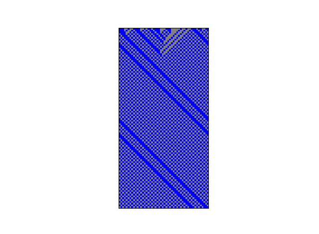
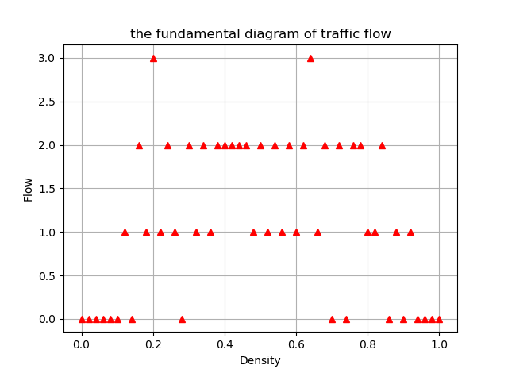

# HW4: Modeling and simulating traffic congestion 
## QA list
1. ECA rule 184 is known as the ’traffic rule’. Implement it; use periodic boundary conditions. Explain in what way it models bottleneck-free congestion by looking at its state transition table.
*  According to , Rule 184 models the congestion with 1 instead of car and 0 instead of space. Cars are moving toward right. With space to the right of car, car will move at next step, otherwise car stopped. When a lot of cars accumulated in block, the bottlenect formed. On the other hand, when a lot of space in block, congestion is free.  
2. Show the evolution of a CA of size N = 50 cells for 50 time steps for the ’car’ densities 0.4 and 0.9. Describe briefly what you see.
* According to which density = 0.4 and  which density = 0.4  

when density is 40%, the flow is 18 and cars(blue) are mostly moving towards right. On the other side, density = 90%, cars(blue) are in huge congetion and accumulated in grey block.  
_You may see code in [RunMeGetCAfigure](RunMeGetCAfigure.py)_
3. Name as many advantages as you can think of for simulating these experiments as opposed to using real cars, drivers, and roads.
* 1. Simulating saves time
  2. Simulating saves money
  3. Simulating is easy to show the results by figure
  4. Simulating can easily change the parameters when in need
  5. Simulating is easy to repeat experiment
4. Write a function 
* According to 
when Value = 0.5, reached phase transition  
_You may find code in [RunMeForTest](RunMeForTest.py)_
5. Now plot the same graph but for a very low T (e.g., T = 5) and a very low number of initial conditions R per density value (e.g., R = 3). What is the effect of such ’undersampling’? Show a plot with undersampled results.  
*   
It is not accurate to expected figure at all.  
_Run RunMeForTex.py and changing R(initStateTime) and T arguments to see figure_
6. 
7. Now it is time to analyze the simulation results, regarding the phenomenon that we started with. Let us say that our minimal model captures the basic phenomenon very well (namely, the existence of a phase transition), using only minimal ingredients (collision avoidance). What can we conclude about the importance of other possible ingredients, such as the gender of drivers or the sizes of their cars, for explaining the existence of the phase transition? Explain why.  
* According to previous experiments and [reference](CA_traffic_flow_real_model.pdf), two extra ingredients should be carefully considered.  
  1. Drivers' driving skill and charactristic (ie.aggressive or discreet). For instance, an aggresive driver may like getting closer to front car and a careful driver may like keeping long distance when driving.
  2. Car and driver's ability to speed up or down. Because drivers need time to **slow down/speed up** when they see another car in front of them. Especially when in good flow, it is easy to happen. The velocity is unable to achived at another value in a flash.