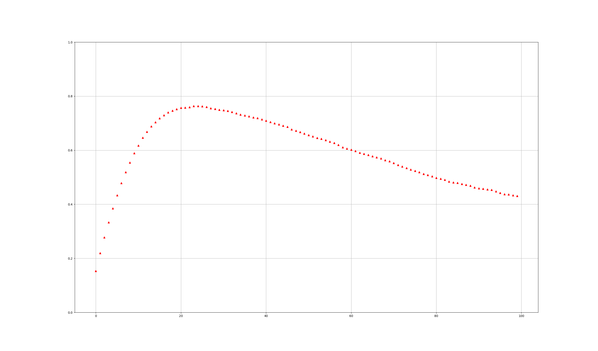

# Malaria Reports  
## Definitions for 3d LIST  
For a list like [1,12], list[0]stands for human state, list[1] stands for mosquitoe state  
1.  Human
* 0 =Dead        
* 1 =Suscepitable
* 2 =Infected    
* 3 =Immune      
2.  Mosquitoes
* 0   =Dead/None Mos
* 4   =No hungry, infected
* 8   =No hungry, iminfected
* 12  =Hungry, infectd
* 16  =Hungry, iminfected  
So when a **suscepitable man(1)** meet a **Hungry infected mosquito(12)** stand for [1,12]
## Definitions for parameters  
pararametrDict =   
{  
    "proOfHumanInfected":proOfHumanInfected,  
    "proOfMosBecomeInfected": proOfMosBecomeInfected,  
    "deathRateOfMos": deathRateOfMos,  
    "deathRateOfInfectedHuman": deathRateOfInfectedHuman,  
    "bornRateOfMos": bornRateOfMos,  
    "immuneRate": immuneRate  
}
## Values for parameters  
* proOfHumanInfected = 0.3  
* proOfMosBecomeInfected = 0.3  
* deathRateOfMos = 0.0007  
* deathRateOfInfectedHuman = 0.0007 
* bornRateOfMos = 0.05  
* immuneRate = 0.1  
## Background 
We chooce a place **Lake endemic** with prevalence = 20 - 40% 3909 deaths and death rate is  3309/2268470/0.42 = 0.0007
## Implementation and result
Run [RunMeForCAanimation.py](RunMeForCAanimation.py) to get animation [universe.mp4](universe.mp4)  
Run [RunMeForStatistic.py] (RunMeForStatistic.py)(by change var of Loop with small value can have a fast result) to get statistic  like below
  
Eventually, the figure shows **prevalence is around 42%** 
